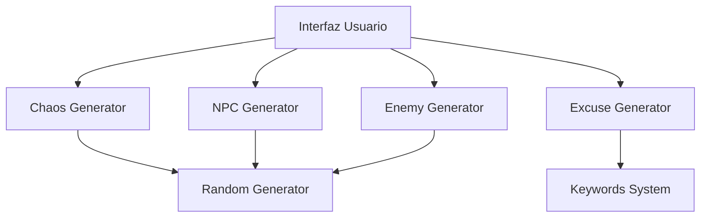

# HELP THE MASTER

Help the master es una aplicación web creada para echar un cable a los DnD Master más novatos. 
Ha sido desarrollado con **JavaScript**, **HTML5** y **CSS3**.


---

## Descripción

**Help The Master** es una herramienta diseñada para asistir a Dungeon Masters durante sus partidas de Dungeons & Dragons. La aplicación proporciona generadores rápidos de contenido improvisado para mantener la partida dinámica, divertida y fluida.

Desde generación de NPCs hasta situaciones caóticas, esta herramienta está pensada para ayudar cuando la imaginación falla o la partida pierde ritmo.

### Características Principales:
* **Generador de NPCs:** Crea personajes con raza, clase, estadísticas y nombres.
* **Generador de Enemigos:** Genera enemigos listos para combate rápidamente con sus puntos de vida aleatorios.
* **Generador de Caos:** Introduce situaciones inesperadas para dinamizar la partida si estáis atascados o se está volviendo aburrida.
* **Generador de Excusas Narrativas:** Crea eventos narrativos coherentes con la historia para poder salir de un aprieto.
* **Diseño Pixel Art:** Interfaz temática inspirada en RPG clásicos para los más nostálgicos.
* **Uso rápido:** Pensado para utilizar durante partidas en vivo. Será como tener una pequeña chuleta.

---

## Instalación

Sigue estos pasos para instalar y ejecutar el proyecto en tu entorno local:

### 1. Clonar el repositorio

```bash
git clone https://github.com/thebridge-er/help-the-master.git
```

---

## Cómo usarla

**1.** Crea un usuario con tu mail y contraseña para poder entrar.
**2.** Selecciona una herramienta desde el menú principal: Crear NPC, enemigos, caos o una escapatoria.
**3.** Introduce el contexto si la herramienta lo requiere.
**4.** Genera personajes con sus stats dando a un solo botón y descarga sus fichas.
**5.** Utiliza el resultado directamente en tu partida.

---

## Tecnologías utilizadas


* **HTML5:** Estructura de la aplicación
* **CSS3:** Diseño responsive y estilo pixel art
* **JavaScript:** Lógica de generación procedural
* **LocalStorage:** Guardado de contenido generado

---

## Estructura del Proyecto

```
.
.
src
├── index.html
├── styles/
│   └── global.css
├── js/
│   └── global.js
├── services/
│   ├── localStorage.js
│   ├── excusesgenerator.js
│   └── keywords.js
├── pages/
│   ├── auth/
│   │   ├── auth.js
│   │   ├── auth.css
│   │   └── auth.html
│   ├── dashboard/
│   │   ├── dashboard.js
│   │   ├── dashboard.css
│   │   └── dashboard.html
│   ├── npc-generator/
│   │   ├── npc-generator.js
│   │   ├── npc-generator.css
│   │   └── npc-generator.html
│   ├── enemy-generator/
│   │   ├── enemy-generator.js
│   │   ├── enemy-generator.css
│   │   └── enemy-generator.html
│   ├── excuses/
│   │   ├── excuses.css
│   │   └── excuses.html
│   └── caos-generator/
│   │   ├── caos-generator.js
│   │   ├── caos-generator.css
│   │   └── caos-generator.html
├── img/
└── README.md
```

---

## Relación de Clases
La aplicación funciona mediante generadores independientes conectados a la interfaz.



---

## Futuras mejoras

* Generador de misiones
* Generador de ciudades
* Generador de tabernas
* Generador de encuentros
* Guardado de favoritos
* Modo oscuro
* Más idiomas
* Generador de personajes con imágenes

---